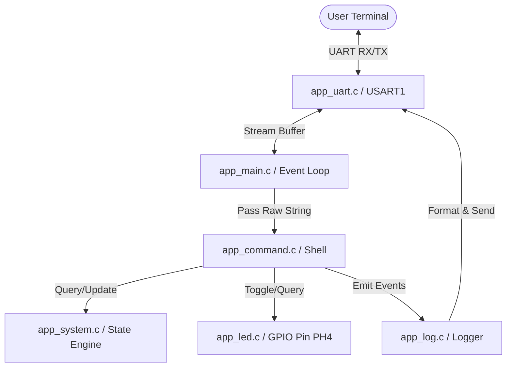

# STM32F7 Smart Logger & CLI Controller

[](https://www.st.com/en/microcontrollers-microprocessors/stm32f7-series.html)
[](https://en.wikipedia.org/wiki/C_(programming_language))
[](https://www.st.com/en/development-tools/stm32cubeide.html)
[](LICENSE)

An elegant, modular CLI (Command Line Interface) controller and system monitor designed for the high-performance **STM32F746IGTX** microcontroller. This project provides a robust, interactive shell over UART, allowing real-time system administration, GPIO control, logging level management, and run-time statistics tracking.

---

## 🌟 Key Features

- 💻 **Interactive Serial CLI**: A robust serial command processor allowing users to control and query the microcontroller via a standard terminal emulator (e.g., Tera Term, PuTTY, or minicom).
- 🏷️ **Modular State Machine**: Dynamic system state transitions (`IDLE`, `RUNNING`, `ERROR`) with structured state access and clean abstraction.
- ⚙️ **Peripheral & GPIO Control**: Command-driven management of physical hardware (LED toggling, state reading, and system resets).
- 📝 **Structured Logging System**: Multi-level diagnostic log messaging system featuring `[INFO]`, `[WARNING]`, and `[ERROR]` levels printed to the console output.
- 📊 **Run-Time Performance Stats**: Integrated execution monitoring, including system uptime tracking (seconds) and interactive command counter stats.
- 🧱 **Clean & Scalable Codebase**: Full architectural separation between application logic (`app_main.c`), system state managers (`app_system.c`), peripheral drivers (`app_led.c`, `app_uart.c`), and command controllers (`app_command.c`).

---

## 🛠️ Architecture Overview

The software design follows a modular, layer-separated structure. This decouples the low-level STM32 hardware abstraction layer (HAL) from high-level user interface commands, making porting or extending the application straightforward.



### Module Descriptions

- **`app_main`**: Handles the non-blocking UART polling character stream, buffers incoming commands, echoes keyboard feedback, and triggers processing upon detecting carriage returns (`\r`/`\n`).
- **`app_system`**: Manages global system states (`IDLE`, `RUNNING`, `ERROR`), counts processed commands, and exposes system uptime calculations derived from standard tick timings (`HAL_GetTick`).
- **`app_command`**: Parses input strings and maps commands to target callbacks. Outputs interactive menu formatting and diagnostic messages.
- **`app_led`**: High-level driver encapsulating the hardware registers for the LED attached to pin **PH4**.
- **`app_uart`**: Wrapper over standard STM32 HAL Transmit commands to facilitate easy string print methods without boilerplate code.
- **`app_log`**: Formats and prints formatted severity logs (`INFO`, `WARNING`, `ERROR`) indicating operations or critical alerts.
- **`app_config`**: Centralized header file storing all hardware definitions, UART buffers, and communication timeouts.

---

## 🔌 Hardware Configurations

The project is preconfigured to target the following MCU pinouts:

| Hardware Component | STM32F746 MCU Pin | Configuration Type | Default Parameters / Hardware Link |
|:---|:---|:---|:---|
| **External Status LED** | `PH4` | GPIO Output (Push-Pull, No Pull) | active-HIGH external indicator LED |
| **USART1 TX** | `PA9` | Alternate Function (UART) | Connected to ST-LINK Virtual COM Port |
| **USART1 RX** | `PA10` | Alternate Function (UART) | Connected to ST-LINK Virtual COM Port |

### UART Parameters
* **Baud Rate**: `115200` bps
* **Data Bits**: `8`
* **Parity**: `None`
* **Stop Bits**: `1`
* **Flow Control**: `None`

---

## 🖥️ Interactive Command Set

Once connected via a terminal, typing `help` lists the following available commands:

| Command | Action Description | Log Level Triggers |
|:---|:---|:---|
| **`help`** | Displays the list of available commands and usage hints. | None |
| **`status`** | Prints the current system state (`IDLE`, `RUNNING`, or `ERROR`). | None |
| **`start`** | Sets the system state to `RUNNING`. | `[INFO] System started` |
| **`stop`** | Sets the system state to `IDLE`. | `[INFO] System stopped` |
| **`led on`** | Turns ON the external LED on `PH4`. | `[INFO] LED ON` |
| **`led off`** | Turns OFF the external LED on `PH4`. | `[INFO] LED OFF` |
| **`led toggle`**| Toggles the external LED state. | `[INFO] LED TOGGLE` |
| **`led status`**| Queries and prints the exact logic state of the LED pin. | None |
| **`uptime`** | Prints the system uptime in seconds since last boot. | None |
| **`stats`** | Displays general telemetry: current state, LED state, uptime, and command usage counts. | None |
| **`reset`** | Sets system state to `IDLE`, turns OFF the LED, and triggers a soft reset. | `[WARNING] System reset` |

---

## ⚡ Getting Started

### 1. Prerequisites
- **IDE**: [STM32CubeIDE](https://www.st.com/en/development-tools/stm32cubeide.html) (v1.10.0 or higher recommended).
- **Debugger**: ST-LINK/V2 onboard programmer or an equivalent hardware debugger.
- **Serial Client**: [Tera Term](https://ttssh2.osdn.jp/index.html.en), [PuTTY](https://www.putty.org/), or Visual Studio Code Serial Monitor.

### 2. Physical Setup
1. Connect the STM32F7 board to your computer via a USB cable connected to the ST-LINK debugger interface.
2. Hook up an LED to pin `PH4` (using a standard current-limiting resistor, e.g., 220Ω to GND).
3. Open your terminal emulator client of choice. Set the serial port to point to the ST-LINK Virtual COM port and configure it with **115200 8N1** parameters. Set your terminal's "Receive" newline setting to **LF** or **CR+LF** for the best viewing experience.

### 3. Build & Run
1. Clone or import this repository folder inside STM32CubeIDE.
2. Build the project by clicking the **Hammer icon** (or pressing `Ctrl+B`).
3. Click the **Debug/Run icon** to flash the `.elf` file using the configuration file `stm32f7_smart_logger.launch`.
4. Press the hardware `RESET` button on the STM32 board or run/resume execution inside the debugger.
5. In your serial terminal, you will see the system boot logo:
   ```text
   STM32F7 Smart Logger Ready
   Type help to see commands
   > 
   ```

---

## 📝 Example Session

An interactive session showing basic inputs, LED switching, telemetry querying, and log updates:

```text
STM32F7 Smart Logger Ready
Type help to see commands
> help

Available commands:
help
status
start
stop
led on
led off
led toggle
led status
reset
uptime
stats

> status

System status: IDLE

> start

[INFO] System started

> led on

[INFO] LED ON

> led status

LED status: ON

> stats

System stats:
State: RUNNING
LED: ON
Uptime: 45 s
Command count: 5

> reset

[WARNING] System reset

> 
```

---

## 📂 Directory Structure

```text
├── .settings/              # IDE preferences
├── Core/
│   ├── Inc/
│   │   ├── app_command.h   # CLI command definitions
│   │   ├── app_config.h    # Pinouts, buffers & configurations
│   │   ├── app_led.h       # LED control definitions
│   │   ├── app_log.h       # Diagnostics log signatures
│   │   ├── app_main.h      # Main controller interface
│   │   ├── app_system.h    # System states and telemetry functions
│   │   ├── app_uart.h      # UART low level wrappers
│   │   └── main.h          # CubeMX generated HAL includes
│   └── Src/
│       ├── app_command.c   # Command interpreter matching logic
│       ├── app_led.c       # Low-level GPIO register write/reads
│       ├── app_log.c       # Logging levels implementations
│       ├── app_main.c      # Characters collection loop
│       ├── app_system.c    # Telemetry and state storage
│       ├── app_uart.c      # HAL UART send wrappers
│       ├── main.c          # MCU system clock and main entry point
│       └── system_stm32f7xx.c
├── Drivers/                # CMSIS and STM32F7xx HAL Driver libraries
├── stm32f7_smart_logger.ioc # CubeMX MCU configurations
└── stm32f7_smart_logger.launch # STM32CubeIDE debugger execution configuration
```
